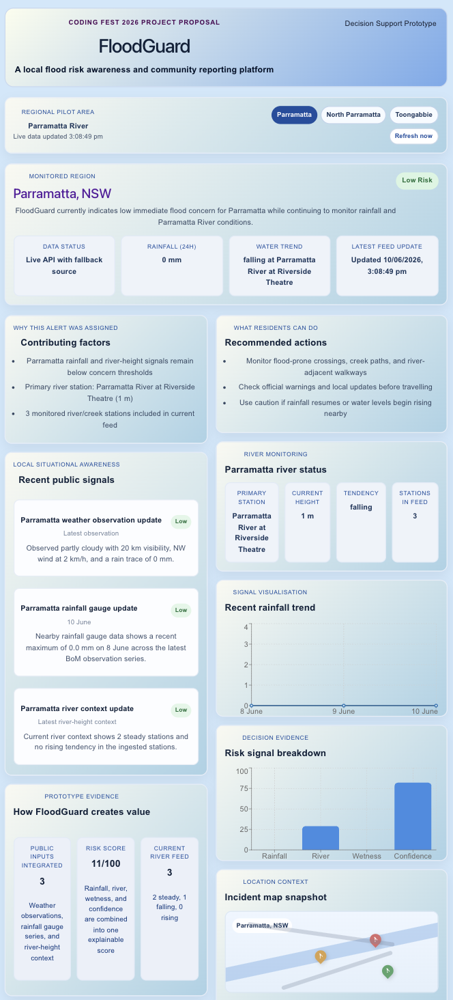

# FloodGuard

FloodGuard is a flood-awareness prototype focused on **GWS** related suburbs - **Parramatta, North Parramatta and Toongabbie**. It combines **local weather observations, rainfall gauge data, and river-context signals** into a single explainable dashboard to help users understand changing local flood conditions. 

## Prototype Preview




## Why FloodGuard

Flood-related information is often scattered across multiple public sources. FloodGuard brings key local signals into one place so residents and planners can more easily see:

- what is happening locally
- which signals are contributing to risk
- what actions may matter next

## Current MVP

The current prototype includes:

- Parramatta-focused dashboard
- weather observation integration
- nearby rainfall trend visualisation
- river-context integration
- automatic backend ingestion pipeline
- unified Parramatta signals API
- config-based regional pilot for Parramatta, North Parramatta, and Toongabbie
- explainable signal summary
- evidence and action-oriented dashboard panels

## Tech Stack

- React
- Vite
- Recharts
- Node.js backend using native HTTP
- Normalised public weather, rainfall, and river data
- Area-specific station relevance mapping

## Data Approach

FloodGuard uses a **real-data-informed prototype pipeline**:

1. Public source files or configured API URLs are fetched by the backend
2. Raw weather, rainfall, and river data is normalised into a consistent internal format
3. Area relevance rules select the weather, rainfall, and river stations that matter for each pilot suburb
4. The backend stores the latest processed regional signal snapshot
5. API routes serve clean JSON to the dashboard
6. The frontend reads from the API first, then falls back to local JSON if the backend is not running

This makes the prototype easier to explain, maintain, and extend.

## Risk Logic

FloodGuard now uses a more explainable rule-based risk engine. The backend computes:

- rainfall pressure
- river pressure
- wetness pressure
- source confidence
- rainfall windows for the latest 24h and 72h

These features are combined into a 0-100 risk score and a Low / Moderate / High concern level.

## Historical Storage

Each ingestion run now stores compact area-level history records. These records preserve:

- risk level and score
- rainfall features
- river station summary
- source freshness and confidence

This gives FloodGuard the memory needed for future baselines, rolling comparisons, and ML-ready feature datasets.

## ML-Ready Features

FloodGuard can now convert stored history into tabular feature rows. These rows include:

- rainfall features
- river tendency features
- wetness and pressure scores
- source confidence
- lagged risk score change
- target label for elevated local concern

This prepares the project for a future baseline classifier without pretending that the current small history is enough for a real model yet.

## Regional Pilot

FloodGuard is now multi-area ready without jumping straight to PostGIS. The current pilot uses a simple config mapping to connect each area to relevant public stations:

- Parramatta
- North Parramatta
- Toongabbie

This is the practical middle step between a single-location prototype and a broader Western Sydney system. It keeps the logic explainable while making the backend reusable for more suburbs and catchments later.

## Run Locally

### Requirements
- Node.js 20.19+ or 22.12+
- npm

### Start the app
```bash
git clone https://github.com/HaleyyT/FloodGuard.git
cd FloodGuard/floodguard-frontend
npm install
npm run dev
```

### Start the ingestion API
```bash
cd FloodGuard/floodguard-frontend
npm run ingest
npm run api
```

The API runs at `http://127.0.0.1:5174` by default.

Useful routes:

- `GET /api/health`
- `GET /api/areas`
- `GET /api/signals?area=parramatta`
- `GET /api/signals?area=north-parramatta`
- `GET /api/signals?area=toongabbie`
- `GET /api/signals?area=toongabbie&refresh=true`
- `GET /api/history?area=parramatta`
- `GET /api/features?area=parramatta`
- `GET /api/features?area=parramatta&format=csv`
- `GET /api/signals/parramatta`
- `GET /api/rainfall/parramatta`
- `GET /api/river/parramatta`
- `GET /api/risk/parramatta`

Optional remote source environment variables:

- `FLOODGUARD_WEATHER_URL`
- `FLOODGUARD_RAINFALL_URL`
- `FLOODGUARD_RIVER_URL`
- `VITE_FLOODGUARD_API_URL`
- `VITE_FLOODGUARD_AREAS_API_URL`
- `VITE_FLOODGUARD_REFRESH_MS`

The dashboard refreshes the selected area automatically. Set `VITE_FLOODGUARD_REFRESH_MS` to control the polling interval; the default is 60 seconds.

By default, FloodGuard now fetches live BoM Parramatta weather observations directly from BoM JSON and derives the rainfall graph from BoM rain-trace observations when no WaterNSW rainfall API URL is configured. `FLOODGUARD_RAINFALL_URL` and `FLOODGUARD_RIVER_URL` are still needed for fully live gauge rainfall and river-height feeds.
