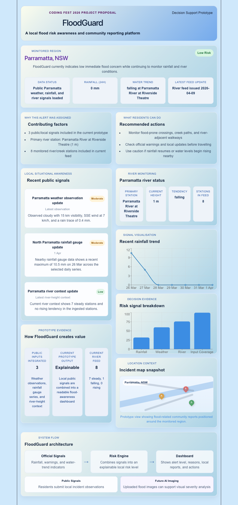

# FloodGuard

FloodGuard is a flood-awareness prototype focused on **Parramatta, NSW**. It combines **local weather observations, rainfall gauge data, and river-context signals** into a single explainable dashboard to help users understand changing local flood conditions. 

## Prototype Preview




## Why FloodGuard

Flood-related information is often scattered across multiple public sources. FloodGuard brings key local signals into one place so residents and planners can more easily see:

- what is happening locally
- which signals are contributing to risk
- what actions may matter next

## Current MVP

The current prototype includes:

- Parramatta-focused dashboard
- weather observation integration
- nearby rainfall trend visualisation
- river-context integration
- automatic backend ingestion pipeline
- unified Parramatta signals API
- explainable signal summary
- evidence and action-oriented dashboard panels

## Tech Stack

- React
- Vite
- Recharts
- Node.js backend using native HTTP
- Normalised public weather, rainfall, and river data

## Data Approach

FloodGuard uses a **real-data-informed prototype pipeline**:

1. Public source files or configured API URLs are fetched by the backend
2. Raw weather, rainfall, and river data is normalised into a consistent internal format
3. The backend stores the latest processed Parramatta signal snapshot
4. API routes serve clean JSON to the dashboard
5. The frontend reads from the API first, then falls back to local JSON if the backend is not running

This makes the prototype easier to explain, maintain, and extend.

## Run Locally

### Requirements
- Node.js 20.19+ or 22.12+
- npm

### Start the app
```bash
git clone https://github.com/HaleyyT/FloodGuard.git
cd FloodGuard/floodguard-frontend
npm install
npm run dev
```

### Start the ingestion API
```bash
cd FloodGuard/floodguard-frontend
npm run ingest
npm run api
```

The API runs at `http://127.0.0.1:5174` by default.

Useful routes:

- `GET /api/health`
- `GET /api/signals/parramatta`
- `GET /api/rainfall/parramatta`
- `GET /api/river/parramatta`
- `GET /api/risk/parramatta`

Optional remote source environment variables:

- `FLOODGUARD_WEATHER_URL`
- `FLOODGUARD_RAINFALL_URL`
- `FLOODGUARD_RIVER_URL`
