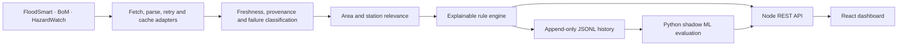

# FloodGuard ([Coding Fest](https://www.sydney.edu.au/engineering/industry-community/partner-with-us/coding-fest.html) Best UG senior project 2nd Prize)


FloodGuard is a reliability-aware flood-awareness and decision-support prototype for the Parramatta pilot area set: Parramatta, North Parramatta, and Toongabbie. The system eliminates data fragmentation by translating rainfall, river, weather, warning-context, and public-signal evidence into an explainable local concern summary. Rather than leaving residents to compare multiple technical feeds manually, it empowers communities to react swiftly to emergent situations by clearly communicating what is happening, why it matters, and what next steps to take.

FloodGuard is not an official emergency-warning system. Official warnings are shown separately from FloodGuard-generated local concern, the live rule engine remains the active authority inside the prototype, and ML remains shadow mode only.

FloodGuard won 2nd prize for Best Undergraduate Senior Project Award at Coding Fest 2026, a competition opened to all university students. FloodGuard's poster was selected for final judging and showcase presentation.


## Engineering snapshot

| Layer | What is implemented on `main` |
|---|---|
| Frontend | React 19, Vite 8, Recharts and Leaflet; responsive multi-area dashboard with live/fallback state, maps and explainable evidence panels |
| Backend | Node.js HTTP API with source-specific adapters, validation, timeouts, retries, caching and stable JSON contracts |
| Data | Append-only JSONL history, latest-valid source cache, evidence snapshots and CSV/JSON feature export |
| Decision logic | Versioned rule engine combining rainfall, river movement, antecedent wetness, public signals and evidence reliability |
| ML | Python 3.12 and scikit-learn shadow pipeline with four-model comparison, leakage controls, time-aware evaluation and generated model cards |
| Quality | Node regression tests, Python ML tests, Playwright browser flows, ESLint, production builds and explicit degraded-source readiness checks |


```mermaid
flowchart LR
    Sources["FloodSmart · BoM · HazardWatch"] --> Adapters["Fetch, parse, retry and cache adapters"]
    Adapters --> Trust["Freshness, provenance and failure classification"]
    Trust --> Mapping["Area and station relevance"]
    Mapping --> Rules["Explainable rule engine"]
    Rules --> API["Node REST API"]
    API --> UI["React dashboard"]
    Rules --> History["Append-only JSONL history"]
    History --> ML["Python shadow ML evaluation"]
    ML --> API
```

> **Storage status:** `main` has **not** migrated to PostgreSQL/PostGIS. It uses JSONL history and coordinate-distance/configured-station relevance. PostgreSQL/PostGIS remains a documented future migration target, not a current capability.


## Technical highlights

Its main technical contribution is the reliability layer. FloodGuard does not treat every source as equally trustworthy: it tracks freshness, provenance, fallback/cache state, official-warning separation, and degraded evidence before those signals are allowed to shape the visible concern summary or notification candidates.


| Area | What FloodGuard implements |
|---|---|
| Ingestion | Rainfall, river, weather, warning-context, and resident/public-signal ingestion |
| Reliability | Freshness checks, provenance, fallback/cache labelling, stale/missing/unavailable states |
| Risk logic | Explainable rule-based concern scoring with decision audit output |
| Notifications | Conservative suppression when degraded core evidence makes stronger advice unsafe |
| History | Queryable JSONL snapshots, replay summaries, decision-audit storage, and ML-ready feature export |
| ML | Python shadow pipeline, baseline models, scenario stress-test data, label audit, and model-card reporting |
| Testing | Backend regression tests, ingestion honesty checks, API contracts, replay coverage, and Playwright smoke flows |


## What is implemented

- Multi-area dashboard for Parramatta, North Parramatta, and Toongabbie
- Live or fallback ingestion paths for rainfall, river, and weather context
- Layered ingestion health with `coreFloodStatus`, `contextStatus`, `warningStatus`, and `overallStatus`
- Source provenance and freshness reporting
- Explainable rule-based risk scoring with decision audit output
- Public community-signal intake with validation, rate limiting, duplicate checks, and review-safe image-link handling
- Image-assisted evidence review queue for linked community-report media
- Historical snapshot storage and tabular feature export
- Replay summaries, compact `decisionSummary` outputs, and queryable review windows
- Notification decision logic with suppression and degraded-data safeguards
- Python ML prototype pipeline for offline training, evaluation, metrics, and model-card reporting
- Shadow-mode ML comparison surfaced in the backend and dashboard without overriding the live rule engine
- Scenario stress-test mode that demonstrates stronger synthetic flood pressure without pretending it is live
- Deterministic Playwright dashboard smoke tests plus replay and failure-injection regression coverage

## Why this project is technically interesting

FloodGuard is not just a visual flood dashboard. It is a reliability-aware decision layer that checks whether evidence is live, stale, cached, fallback-based, missing, or unavailable before allowing it to influence user-facing concern levels or notification decisions.

That matters because high-stakes software should not only produce a status label; it should also make the quality, limits, and trustworthiness of its evidence visible before people act on it.

## Project structure

- [floodguard-frontend](./floodguard-frontend/README.md): React dashboard and Node ingestion/API layer
- [floodguard-ml](./floodguard-ml/README.md): Python ML experimentation workspace
- [docs](./docs): public screenshots and diagram assets used to present FloodGuard
- [explanation.md](./explanation.md): beginner-friendly guide to FloodGuard's framework, logic, reliability model, and ML boundaries

## How FloodGuard works

1. Public source adapters fetch rainfall, river, weather, and warning context when available.
2. Source metadata records freshness, mode, strength, and fallback/degraded state.
3. Area mapping and lightweight spatial relevance select the best local context for each pilot suburb.
4. The rule engine combines rainfall, river, wetness, confidence, and public-signal pressure into an explainable concern score.
5. The dashboard presents current concern, trust state, why the concern was assigned, and recommended next steps.
6. Historical snapshots are exported into feature rows for offline Python ML experiments.
7. A scenario stress-test mode can demonstrate stronger synthetic flood pressure without confusing it with the live area state.
8. ML results are shown in shadow mode only and do not control live alerts.

## External API and map integrations

| Integration | How FloodGuard uses it | Failure-aware behaviour |
|---|---|---|
| City of Parramatta FloodSmart API | Rainfall and river/creek gauge stations plus time-series observations | Applies configured station mapping, timeouts and retries; reuses labelled cache/fallback evidence instead of silently claiming it is live |
| Bureau of Meteorology JSON | Parramatta weather and supporting rainfall context | Tracks its observation timestamp independently and allows supporting context to be stale without disguising it as current |
| NSW SES / HazardWatch | Parses official warning context from the public HazardWatch application payload | Keeps official warnings separate from FloodGuard concern and exposes no-match, stale, parser-error and unavailable states |
| OpenStreetMap + Leaflet | Area map, local gauges, approximate community observations and warning context | Rounds contributed map locations to approximately 100 metres and clearly distinguishes unverified reports |

The Node API exposes source health, ingestion observability, decision audit, warning status, spatial relevance, history, notification previews and ML shadow reports as separate contracts. This separation makes it possible to diagnose whether the application is healthy even when an upstream source is not.

## Why the reliability layer matters

FloodGuard is designed to avoid a common prototype failure mode: looking “live” even when sources are stale, missing, or fallback-only.

The app checks:

- whether rainfall and river gauges are current enough for a live claim
- whether supporting context is stale or partial
- whether official warnings are live, stale, unavailable, or still missing
- whether recent cache is being reused because a live refresh failed

This means the dashboard can say “blocked”, “partial”, or “fallback” instead of silently pretending the data is current.

## Machine learning: evaluated in shadow mode

FloodGuard exports rainfall, river, wetness, lag and reliability features into a Python 3.12/scikit-learn pipeline. The pipeline compares simple and ensemble models, generates model cards and feature-importance reports, and blocks leakage-prone fields such as risk scores, rule labels, event labels and provenance metadata from predictors.

The current real-export experiment contains **3,000 rows**: 2,982 lower-concern rows and **18 rule-derived elevated rows (0.6%)**. Because there are currently no independently reviewed elevated event windows, these results measure agreement with prototype rule-derived supervision—not real flood-prediction performance.

### Current real-export results

| Model | Purpose | Accuracy | Balanced accuracy | Precision | Recall | F1 | PR-AUC |
|---|---|---:|---:|---:|---:|---:|---:|
| Majority baseline | Class-imbalance reference | 0.992 | 0.500 | 0.000 | 0.000 | 0.000 | 0.008 |
| Logistic regression | Interpretable linear baseline | 0.994 | 0.625 | 1.000 | 0.250 | 0.400 | 0.261 |
| Random forest | Non-linear tree ensemble | 0.613 | **0.805** | 0.020 | **1.000** | 0.040 | 0.265 |
| Extra Trees | Randomised tree ensemble | 0.994 | 0.625 | 1.000 | 0.250 | 0.400 | **0.265** |

Random forest is the current prototype leader by balanced accuracy and recalls all eight elevated examples in its evaluated split, but its 2% precision means it produces many false escalations. Logistic regression and Extra Trees are much more selective but each detects only two of eight elevated examples. The 99% plain-accuracy scores are not treated as success because the dataset is extremely imbalanced.

The pipeline also includes a deliberately synthetic scenario stress test. Perfect scores on that dataset show that the end-to-end modelling pipeline can separate constructed scenarios; they are not evidence of real-world forecasting accuracy.

### ML engineering safeguards

- majority baseline before comparing trained models
- chronological and area-based validation plus degraded-source slices
- event holdout that fails closed until reviewed positive and negative events exist
- explicit feature leakage audit
- balanced accuracy, precision, recall, F1, ROC-AUC, PR-AUC and Brier score reporting
- deterministic reports, model cards, calibration summaries and feature-importance artifacts
- no ML control over resident concern levels or notifications
- rule engine remains the live decision authority

See the generated [model comparison](floodguard-ml/reports/model_comparison.md), [model card](floodguard-ml/reports/model_card.md) and [label audit](floodguard-ml/reports/label_audit.md) for reproducible detail.

## Safety and domain expert oversight

FloodGuard does not replace NSW SES, Bureau of Meteorology, council, or emergency-service advice. The project currently provides local flood-awareness support by combining public signals with reliability checks and explainable risk logic.

Because flood-risk guidance is high stakes, future versions require expert review of:

- rainfall thresholds and river-signal calibration
- next-step wording and notification safety
- when degraded evidence should suppress stronger guidance
- ML labels, validation strategy, and operational boundaries

FloodGuard therefore keeps:

- official warnings separate from FloodGuard-generated concern
- stale and cached data labelled explicitly
- strong app-generated alerts suppressed when core evidence is degraded
- ML in shadow mode rather than operational use

## Verification

FloodGuard verifies:

- backend ingestion, source-health, API and decision-presentation contracts
- timeout, parser, stale-cache, fallback and unavailable-source behaviour
- dashboard flows across all three pilot locations and simulated/live modes
- ML leakage controls, label gates, replay logic and report stability
- ESLint and the production Vite build
- submission readiness separately from strict live-source readiness

## Limitations

- Official NSW SES / HazardWatch integration is now connected through a default public HazardWatch adapter, but it is not yet mature enough to count as a stable live operational warning feed in every run.
- Core live-gauge ingestion can degrade to stale cache or fallback depending on source availability.
- Historical storage is currently JSONL-based prototype storage, not PostgreSQL/PostGIS or production-grade event storage.
- Spatial relevance uses configured station mapping and coordinate distance; it does not yet perform PostGIS polygon/catchment intersection.
- Risk thresholds are heuristic and not yet calibrated against validated flood outcomes.
- The ML layer remains shadow mode until stronger labels and broader validation exist.
- Future deployment requires hydrologist, council, and emergency-management review before any operational safety use.

## Run locally

### Requirements

- Node.js 20.19+ or 22.12+
- npm
- Python 3.12 for the `floodguard-ml` workspace

### Quick start for judges and reviewers

```bash
cd floodguard-frontend
npm install
npm run demo
```

Then open `http://127.0.0.1:4173/`.

`npm run demo` is the easiest end-to-end command for manual review because it refreshes one ingestion snapshot, starts the Node API, and starts the frontend with the correct local API wiring. The commands below remain available if you want to run components manually.

## How to use FloodGuard

***Please wait for FloodGuard to refresh before using the dashboard.*** Check the status near the area selector: it should show **Live feed**, **Fallback mode** or another explicit reliability state. If all sources display **Unknown**, the frontend is open but the Node API is probably not running; use `npm run demo` or start both components manually.

1. Select **Parramatta**, **North Parramatta** or **Toongabbie** near the top of the page. Wait for the chosen location to finish loading before interpreting its values.
2. Open **Overview** to see the concern level, evidence confidence, recommended actions, rainfall/river summaries, local map and source-status cards.
3. Open **Signals** for detailed source diagnostics, the separate **NSW SES / HazardWatch** status, station relevance and the rule engine’s decision audit.
4. Open **Community** to inspect local reports or submit an approximate observation. These reports are supplementary and remain clearly unverified.
5. Open **Notices** to inspect notification candidates and the reasons that stronger notices were emitted or suppressed.
6. Open **Model** to inspect the shadow comparison, dataset quality and limitations. ML does not change the live concern level.
7. Open **Architecture** for a plain-language view of the system flow.
8. Use **Refresh now** to request new API data. The **Scenario stress-test** is a labelled simulation; switch back to **Current source state** for real source status.

### Start the dashboard manually

```bash
cd floodguard-frontend
npm install
npm run dev
```

### Start the API manually

```bash
cd floodguard-frontend
npm run api
```

### Camera-ready verification

```bash
cd floodguard-frontend
npm run test
npm run build
npm run check:ingestion
```

For the current prototype, `npm run check:ingestion` is the camera-ready honesty gate. It passes when degraded, stale, cached, unavailable, or partially connected sources are labelled safely rather than misrepresented as live. `npm run check:ingestion:live` is stricter and should only pass when rainfall, river, and supporting live context are genuinely current.

### Refresh ingestion manually

```bash
cd floodguard-frontend
npm run ingest
```

### Collect source snapshots for evidence/history review

```bash
cd floodguard-frontend
npm run collect:sources
```

### Check ingestion honesty state

```bash
cd floodguard-frontend
npm run check:ingestion
```

### Run backend tests

```bash
cd floodguard-frontend
npm run test
```

### Run end-to-end smoke tests

```bash
cd floodguard-frontend
npm run test:e2e
```

### Build production frontend

```bash
cd floodguard-frontend
npm run build
```

### Run the Python ML pipeline

See [floodguard-ml/README.md](./floodguard-ml/README.md).

## Demo walkthrough

1. Select a pilot area.
2. Inspect the current concern level and key concern drivers.
3. Check source-health and evidence reliability to see whether the signals are live, stale, cached, fallback, or unavailable.
4. Review the decision audit and rainfall/river context to understand why the concern level was assigned.
5. Inspect notifications and public signals to see how FloodGuard behaves under stronger or degraded evidence.
6. Review the ML shadow output, noting that it is comparison-only and does not control live alerts.

## Key API routes

- `GET /api/health`
- `GET /api/ingestion-health`
- `GET /api/ingestion-observability`
- `GET /api/areas`
- `GET /api/signals?area=parramatta`
- `GET /api/source-registry?area=parramatta`
- `GET /api/source-health?area=parramatta`
- `GET /api/ingestion-readiness`
- `GET /api/decision-audit?area=parramatta`
- `GET /api/community-reports?area=parramatta`
- `POST /api/community-reports`
- `GET /api/evidence-review?area=parramatta`
- `GET /api/history?area=parramatta`
- `GET /api/features?area=parramatta`
- `GET /api/dataset-quality?area=parramatta`
- `GET /api/baseline-prediction?area=parramatta`
- `GET /api/model-experiment?area=parramatta`
- `GET /api/model-card?area=parramatta`
- `GET /api/ml/report`
- `GET /api/ml/prediction-preview?area=parramatta`
- `GET /api/ml/readiness?area=parramatta`
- `GET /api/ml/dataset?area=parramatta`
- `GET /api/notifications?area=parramatta`
- `GET /api/notifications/preview?area=parramatta`
- `GET /api/warnings?area=parramatta`
- `GET /api/spatial-relevance?area=parramatta`

Example:

```bash
curl "http://127.0.0.1:5174/api/signals?area=parramatta"
curl "http://127.0.0.1:5174/api/decision-audit?area=parramatta"
curl "http://127.0.0.1:5174/api/warnings?area=parramatta"
```

## Submission notes

FloodGuard's internal submission-writing notes, poster drafts, verification logs, and planning documents are kept as private working material and are not part of the public repo surface.

The public repo keeps the implementation, screenshots, diagrams, roadmap, and beginner-facing explanation that are most useful for reviewers, judges, and future collaborators.

## Ingestion-readiness note

FloodGuard now separates:

- submission readiness, where degraded external sources are acceptable if they are labelled honestly
- strict live-source readiness, where rainfall and river must be genuinely fresh live readings

This is why a stale-source run can still demonstrate a successful trust layer even when strict live operation is not currently available.

## References

- Breiman, L. (2001). Random forests. *Machine Learning, 45*(1), 5-32. https://doi.org/10.1023/A:1010933404324
- Bureau of Meteorology. (n.d.). *New South Wales rain and river data*. Retrieved July 7, 2026, from https://www.bom.gov.au/nsw/flood/rain_river.shtml
- City of Parramatta. (n.d.). *Check your river and rain gauge levels*. Retrieved July 7, 2026, from https://www.cityofparramatta.nsw.gov.au/environment/flooding-and-emergencies/floodsmart-parramatta/check-your-river-and-rain-gauge-levels
- City of Parramatta FloodSmart. (n.d.). *Lizard measuring stations API* [Data set]. Retrieved July 7, 2026, from https://parramatta.lizard.net/api/v4/measuringstations/
- Cox, D. R. (1958). The regression analysis of binary sequences. *Journal of the Royal Statistical Society: Series B (Methodological), 20*(2), 215-242.
- Data.NSW. (n.d.). *Hazard Watch* [Data set]. Retrieved July 7, 2026, from https://data.nsw.gov.au/data/dataset/hazard-watch
- Geurts, P., Ernst, D., & Wehenkel, L. (2006). Extremely randomized trees. *Machine Learning, 63*(1), 3-42. https://doi.org/10.1007/s10994-006-6226-1
- HazardWatch. (n.d.). *HazardWatch*. Retrieved July 7, 2026, from https://www.hazardwatch.gov.au/
- NSW Flood Data Portal. (n.d.). *NSW Flood Data Portal*. Retrieved July 7, 2026, from https://flooddata.ses.nsw.gov.au/
- NSW State Emergency Service. (n.d.). *Understand warning levels*. Retrieved July 7, 2026, from https://www.ses.nsw.gov.au/understand-warnings
